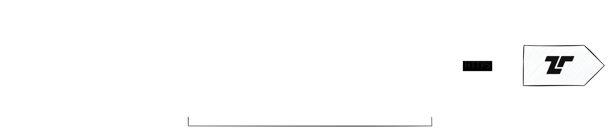

[SentinelOne](https://www.sentinelone.com) is a cybersecurity platform that
provides endpoint protection and threat detection. The SentinelOne [Singularity
Data Lake](https://www.sentinelone.com/products/singularity-data-lake/) allows
you to store and analyze security events at scale. Tenzir provides bidirectional
integration with the SentinelOne Data Lake via its REST API.



## Query events from SentinelOne Data Lake

Use the [`from_sentinelone_data_lake`](/reference/operators/from_sentinelone_data_lake)
operator to retrieve security events from the Data Lake using PowerQuery:

```tql
from_sentinelone_data_lake "https://xdr.eu1.sentinelone.net",
  token=secret("SENTINELONE_TOKEN"),
  query="EventType = 'Process Creation'",
  start=now()-7d
```

Replace `https://xdr.eu1.sentinelone.net` with your regional SentinelOne endpoint
and configure the `SENTINELONE_TOKEN` secret with your API token.

### Specify a custom time range

You can specify both start and end times to retrieve events from a specific window:

```tql
from_sentinelone_data_lake "https://xdr.eu1.sentinelone.net",
  token=secret("SENTINELONE_TOKEN"),
  query="ThreatIndicator IsNotNull",
  start=now()-10d,
  end=now()-3d
```

## Send events to SentinelOne Data Lake

Use the [`to_sentinelone_data_lake`](/reference/operators/to_sentinelone_data_lake)
operator to send structured security events to the Data Lake. The operator
provides special handling for OCSF events—if it detects that the input event is
OCSF, it will automatically map timestamp and severity fields to the
corresponding SentinelOne Data Lake fields.

### Send events

```tql
subscribe "suricata"
where @name == "suricata.alert"
to_sentinelone_data_lake "https://ingest.eu1.sentinelone.net",
  token=secret("SENTINELONE_TOKEN")
```

Replace `https://ingest.eu1.sentinelone.net` with your configured SentinelOne
Data Lake ingest URL and configure the `SENTINELONE_TOKEN` secret with your
bearer token.

### Send events with session information

You can include additional session information that identifies the source of the
events:

```tql
subscribe "network-events"
to_sentinelone_data_lake "https://ingest.eu1.sentinelone.net",
  token=secret("SENTINELONE_TOKEN"),
  session_info={
    serverHost: "Tenzir Node 01",
    serverType: "Tenzir Node",
    region: "US East"
  }
```

### Send OCSF events

If the datastream input is valid OCSF, the operator will automatically extract
timestamp and severity fields and map them to the corresponding SentinelOne Data
Lake fields `ts` and `sev`:

```tql
subscribe "ocsf"
where severity_id >= 4  // High and Critical events only
to_sentinelone_data_lake "https://ingest.eu1.sentinelone.net",
  token=secret("SENTINELONE_TOKEN"),
  session_info={serverHost: "Security Gateway"}
```

### Send unstructured data

You can also use the operator to send unstructured data and let SentinelOne parse
it. Simply give the operator a `message` field as input and specify a `parser`
in the `session_info` argument:

```tql
select message = this.print_ndjson();         // Format the entire event as JSON
to_sentinelone_data_lake "https://ingest.eu1.sentinelone.net",
  token=secret("sentinelone-token"),
  session_info={
    serverHost: "Node 42",
    parser: "json",                           // Have SentinelOne parse the data
  }
```

In this example, we are formatting the entire event as JSON and sending it
as the message field. The SentinelOne `json` parser will then parse the event
again.

:::note[Ingest Costs]
SentinelOne charges per ingested byte in any value, including the unstructured
`message`. This means SentinelOne charges for keys, structural elements and
whitespace in `message`.

If you already have structured data in Tenzir, prefer sending structured data.
SentinelOne will only charge for the values, one byte per key and nothing for
the requests structure.
:::
