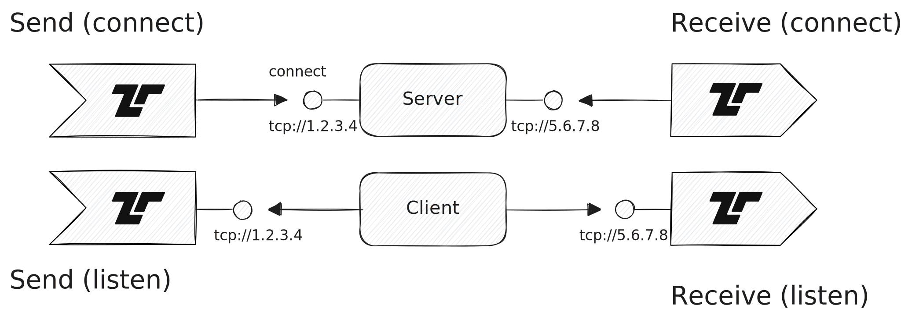

The [Transmission Control Protocol
(TCP)](https://en.wikipedia.org/wiki/Transmission_Control_Protocol) offers a
bi-directional byte stream between applications that communicate via IP. Tenzir
provides operators for both sides of a TCP conversation: connecting to remote
endpoints and accepting incoming connections.

## Connecting to remote endpoints

Use [`from_tcp`](/reference/operators/from_tcp) to connect to a remote TCP
endpoint as a client and read data from it. The operator reconnects
automatically with exponential backoff on connection failure.

## Accepting incoming connections

Use [`accept_tcp`](/reference/operators/accept_tcp) to listen on a local
endpoint and accept incoming TCP connections. Each connection spawns a nested
pipeline that processes the incoming byte stream independently.

## Serving data to clients

Use [`serve_tcp`](/reference/operators/serve_tcp) to start a TCP server that
broadcasts pipeline output to all connected clients. A nested pipeline
serializes events into bytes before sending.

See the [Get data from the network](/guides/collecting/get-data-from-the-network/)
guide for practical examples.

## SSL/TLS

All TCP operators support TLS via the `tls` option. Pass an empty record
(`tls={}`) for defaults, or provide specific options like `certfile` and
`keyfile`.
