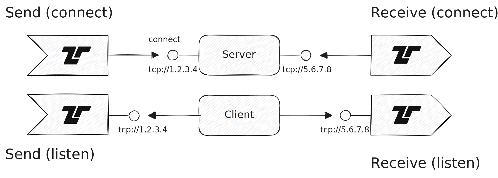

The [Transmission Control Protocol
(TCP)](https://en.wikipedia.org/wiki/Transmission_Control_Protocol) provides a
bidirectional byte stream over IP. Tenzir provides operators for both sides of
a TCP conversation: connecting to remote endpoints, accepting incoming
connections, and serving data to connected clients.

Use the IP address `0.0.0.0` to listen on all available network interfaces.

:::tip[URL support]
The URL schemes `tcp://` and `tcps://` dispatch to <Op>load_tcp</Op> and <Op>save_tcp</Op> for seamless URL-style use via <Op>from</Op> and <Op>to</Op>.
:::

## Connecting to remote endpoints

Use <Op>from_tcp</Op> to connect to a remote TCP endpoint as a client and read
data from it, or <Op>to_tcp</Op> to send data to a remote endpoint. Both
operators reconnect automatically with exponential backoff on connection failure.

## Accepting incoming connections

Use <Op>accept_tcp</Op> to listen on a local endpoint and accept incoming TCP
connections. Each connection spawns a nested pipeline that processes the
incoming byte stream independently.

## Serving data to clients

Use <Op>serve_tcp</Op> to start a TCP server that broadcasts pipeline output to
all connected clients. A nested pipeline serializes events into bytes before
sending.

See <Guide>collecting/get-data-from-the-network</Guide> for practical examples.

## SSL/TLS

All TCP operators support TLS via the `tls` option. Pass an empty record
(`tls={}`) for defaults, or provide specific options like `certfile` and
`keyfile`.
