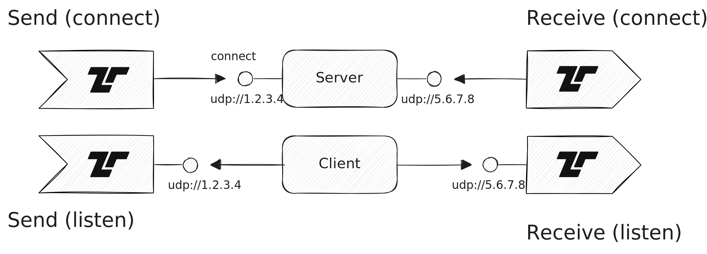

The [User Datagram Protocol
(UDP)](https://en.wikipedia.org/wiki/User_Datagram_Protocol) is a
connection-less protocol to send messages on an IP network. Tenzir supports
writing to and reading from UDP sockets, both in server (listening) and client
(connect) mode.



Use the IP address `0.0.0.0` to listen on all available network interfaces.

## Examples

Use [`from_udp`](/reference/operators/from_udp) to receive UDP datagrams as
structured events containing message data and peer information. For sending, use
[`save_udp`](/reference/operators/save_udp) with a write operator.

### Receive syslog messages over UDP

```tql
from_udp "0.0.0.0:514"
this = data.parse_syslog()
```

### Send events to a UDP socket

```tql
from {message: "Tenzir"}
write_ndjson
save_udp "1.2.3.4:8080"
```
