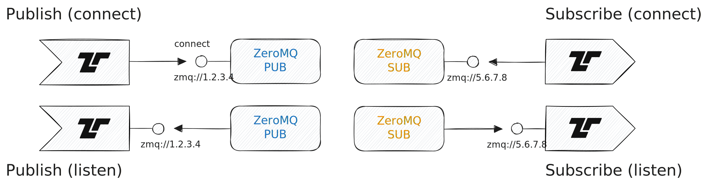

[ZeroMQ](https://zeromq.org/) (0mq) is a light-weight messaging framework with
various socket types. Tenzir supports writing to [PUB
sockets](https://zeromq.org/socket-api/#pub-socket) and reading from [SUB
sockets](https://zeromq.org/socket-api/#sub-socket), both in bind mode and
connect mode.



Use the IP address `0.0.0.0` to listen on all available network interfaces.

The new executor provides event-oriented ZeroMQ operators:

- <Op>from_zmq</Op>: Connects as a `SUB` socket and receives events.
- <Op>accept_zmq</Op>: Binds a `SUB` socket and receives events.
- <Op>to_zmq</Op>: Connects as a `PUB` socket and sends events.
- <Op>serve_zmq</Op>: Binds a `PUB` socket and sends events.

Tenzir documents these operators for PUB/SUB-style use. ZeroMQ itself does not
have a first-class topic abstraction. Instead, Tenzir uses an optional `prefix`
that is prepended to outgoing messages and matched by subscribers with ZeroMQ's
native byte-prefix filtering. Receivers strip the matched prefix before running
their nested `read_*` pipeline unless `keep_prefix=true`.

Because ZeroMQ is entirely asynchronous, publishers send messages even when no
subscriber is present. This can lead to lost messages when the publisher begins
operating before the subscriber. To avoid data loss due to such races, pass
`monitor=true` on <Op>to_zmq</Op>, <Op>serve_zmq</Op>, or the legacy
<Op>save_zmq</Op> operator to wait until at least one remote peer has connected
on TCP transports.

## Examples

### Connect to a remote publisher and parse JSON

```tql
from_zmq "tcp://collector.example.com:5555" {
  read_json
}
```

### Receive a prefixed stream

```tql
accept_zmq "tcp://0.0.0.0:5555", prefix="alerts/" {
  read_ndjson
}
```

### Publish events with a dynamic prefix

```tql
export
serve_zmq "tcp://0.0.0.0:5555", encoding="json", prefix=kind + "/"
```

### Connect and publish JSON

```tql
export
to_zmq "tcp://collector.example.com:5555", encoding="json"
```
