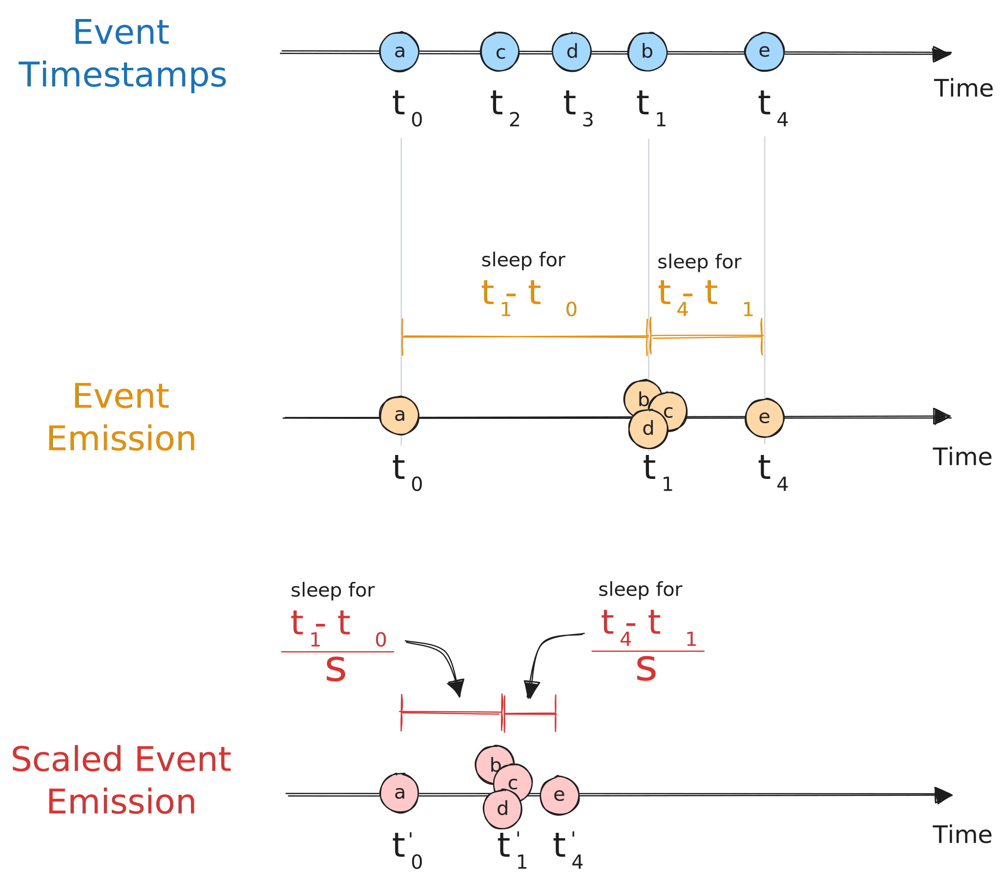

Delays events relative to a given start time, with an optional speedup.

```tql
delay field:time, [start=time, speed=double]
```

## Description

The `delay` operator replays a dataflow according to a time field by introducing
sleeping periods proportional to the inter-arrival times of the events.

With the `speed` option, you can adjust the sleep time of the time series
induced by `field` with a multiplicative factor. This has the effect of making
the time series "faster" for values great than 1 and "slower" for values less
than 1. Unless you provide a start time with `start`, the operator will anchor
the timestamps in `field` to begin with the current wall clock time, as if you
provided `start=now()`.

The diagram below illustrates the effect of applying `delay` to dataflow. If an
event in the stream has a timestamp the precedes the previous event, `delay`
emits it instantly. Otherwise `delay` sleeps the amount of time to reach the
next timestamp. As shown in the last illustration, the `speed` factor has a
scaling effect on the inter-arrival times.



The options `start` and `speed` work independently, i.e., you can use them
separately or both together.

### `field: time`

The field in the event containing the timestamp values.

### `start = time (optional)`

The timestamp to anchor the time values around.

Defaults to the first non-null timestamp in `field`.

### `speed = double (optional)`

A constant factor to be divided by the inter-arrival time. For example, 2.0
decreases the event gaps by a factor of two, resulting a twice as fast dataflow.
A value of 0.1 creates dataflow that spans ten times the original time frame.

Defaults to 1.0.

## Examples

### Replay logs in real time

Replay the M57 Zeek logs with real-world inter-arrival times from the `ts`
field. For example, if an event arrives at time *t* and the next event at
time *u*, then the `delay` operator will wait time *u - t* between emitting the
two events. If *t > u* then the operator immediately emits next event.

```tql
load_http "https://storage.googleapis.com/tenzir-datasets/M57/zeek-all.log.zst"
read_zeek_tsv
delay ts
```

### Replay logs at 10.5 times the original speed

```tql
load_http "https://storage.googleapis.com/tenzir-datasets/M57/zeek-all.log.zst"
read_zeek_tsv
delay ts, speed=10.5
```

### Replay and delay after a given timestamp

Replay and start delaying only after `ts` exceeds `2021-11-17T16:35` and emit
all events prior to that timestamp immediately.

```tql
load_file "https://storage.googleapis.com/tenzir-datasets/M57/zeek-all.log.zst"
read_zeek_tsv
delay ts, start=2021-11-17T16:35, speed=10.0
```

Adjust the timestamp to the present, and then start replaying in 2 hours from
now:

```tql
load_file "https://storage.googleapis.com/tenzir-datasets/M57/zeek-all.log.zst"
decompress "zstd"
read_zeek_tsv
timeshift ts
delay ts, start=now()+2h
```
## See Also

[`timeshift`](timeshift)
