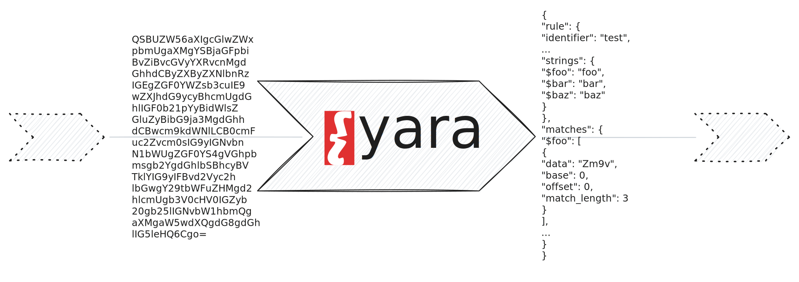

Executes YARA rules on byte streams.

```tql
yara rule:string|list<string>, [compiled_rules=bool, fast_scan=bool]
```

## Description

The `yara` operator applies [YARA](https://virustotal.github.io/yara/) rules to
an input of bytes and emits rule context for each match.



We modeled the operator after the official [`yara` command-line
utility](https://yara.readthedocs.io/en/stable/commandline.html) to enable a
familiar experience for command-line users. Similar to the official `yara`
command, the operator compiles the rules by default unless you provide the
`compiled_rules=true` option. To quote from the above link:

> This is a security measure to prevent users from inadvertently using compiled
> rules coming from a third-party. Using compiled rules from untrusted sources
> can lead to the execution of malicious code in your computer.

The operator scans the entire logical input as one contiguous byte sequence.
It buffers the full input in memory and runs the YARA scan when the input ends.
This lets matches span chunk boundaries, but it also means the operator is only
suitable for finite byte streams.

### `rule: string | list<string>`

The path to one YARA rule or a list of rule paths.

If a path is a directory, the operator attempts to recursively add all
contained files as YARA rules.

### `compiled_rules = bool (optional)`

Whether to interpret the rules as compiled.

When you provide this flag, you must provide exactly one rule path as the
positional argument.

### `fast_scan = bool (optional)`

Enable fast matching mode.

## Examples

The examples below show how you can scan a single file and how you can create a
simple rule scanning service.

### Perform one-shot scanning of files

Scan a file with a set of YARA rules:

```tql
load_file "evil.exe", mmap=true
yara "rule.yara"
```

:::note[Memory mapping optimization]
The `mmap` flag is an optimization that constructs a single chunk of bytes
instead of a stream of byte chunks. Without `mmap=true`,
[`load_file`](/reference/operators/load_file) produces multiple byte chunks and
feeds them to the `yara` operator. This still works because `yara` buffers the
full input in memory before scanning, but `mmap=true` avoids the extra copy and
usually performs better.
:::

:::caution[Finite inputs only]
`yara` waits for the end of input before it emits any matches. Don't use it on
never-ending byte streams.
:::

Let's unpack a concrete example:

```
rule test {
  meta:
    string = "string meta data"
    integer = 42
    boolean = true

  strings:
    $foo = "foo"
    $bar = "bar"
    $baz = "baz"

  condition:
    ($foo and $bar) or $baz
}
```

You can produce test matches by feeding bytes into the `yara` operator.
You will get one `yara.match` per matching rule:

```tql
{
  rule: {
    identifier: "test",
    namespace: "default",
    tags: [],
    meta: {
      string: "string meta data",
      integer: 42,
      boolean: true
    },
    strings: {
      "$foo": "foo",
      "$bar": "bar",
      "$baz": "baz"
    }
  },
  matches: {
    "$foo": [
      {
        data: "Zm9v",
        base: 0,
        offset: 0,
        match_length: 3
      }
    ],
    "$bar": [
      {
        data: "YmFy",
        base: 0,
        offset: 4,
        match_length: 3
      }
    ]
  }
}
```

Each match has a `rule` field that describes the rule and a `matches` record
indexed by string identifier to report a list of matches per rule string.
