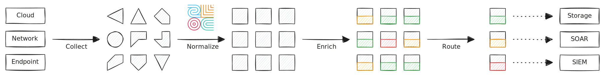
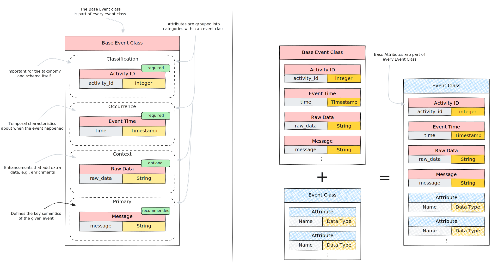

In this tutorial you'll learn how to **map events to [Open Cybersecurity Schema
Framework (OCSF)](https://schema.ocsf.io)**. We walk you through an example of
events from a network monitor and show how you can use Tenzir pipelines to
easily transform them so that they become OCSF-compliant events.



The diagram above illustrates the data lifecycle and the OCSF mapping takes
place: you collect data from various data sources, each of which has a different
shape, and then convert them to a standardized representation. The primary
benefit is that **normalization decouples data acquisition from downstream
analytics**, allowing the processes to scale independently.

## OCSF Primer

The OCSF is a vendor-agnostic event schema (aka. "taxonomy") that defines
structure and semantics for security events. Here are some key terms you need to
know to map events:

- **Attribute**: a unique identifier for a specific type, e.g., `parent_folder`
  of type `String` or `observables` of type `Observable Array`.
- **Event Class**: the description of an event defined in terms of attributes,
  e.g., `HTTP Activity` and `Detection Finding`.
- **Category**: a group of event classes, e.g., `System Activity` or `Findings`.

The diagram below illustrates how subsets of attributes form an event class:


The **Base Event Class** is a special event class that's part of every event
class. Think of it as a mixin of attributes that get automatically added:



For this tutorial, we look at OCSF from the perspective of the _mapper_ persona,
i.e., as someone who converts existing events into the OCSF schema. OCSF also
defines three other personas, author, producer, and analyst. These are out of
scope. Our mission as mapper is now to study the event semantics of the data
source we want to map, and translate the event to the appropriate OCSF event
class.

## Case Study: Zeek Logs

Let's map some [Zeek](https://zeek.org) logs to OCSF!

:::note[What is Zeek?]
The [Zeek](https://zeek.org) network monitor turns raw network traffic into
detailed, structured logs. The logs range across the OSI stack from link layer
activity to application-specific messages. In addition, Zeek provides a powerful
scripting language to act on network events, making it a versatile tool for
writing network-based detections to raise alerts.
:::

Zeek generates logs in tab-separated values (TSV) or JSON format. Here's an
example of a connection log in TSV format:

```text title="conn.log (TSV)"
#separator \x09
#set_separator	,
#empty_field	(empty)
#unset_field	-
#path	conn
#open	2023-03-07-10-23-46
#fields	ts	uid	id.orig_h	id.orig_p	id.resp_h	id.resp_p	id.vlan	id.vlan_inner	proto	service	duration	orig_bytes	resp_bytes	conn_state	local_orig	local_resp	missed_bytes	history	orig_pkts	orig_ip_bytes	resp_pkts	resp_ip_bytes	tunnel_parents	vlan	inner_vlan	orig_l2_addr	resp_l2_addr	geo.orig.country_code	geo.orig.region	geo.orig.city	geo.orig.latitude	geo.orig.longitude	geo.resp.country_code	geo.resp.region	geo.resp.city	geo.resp.latitude	geo.resp.longitude	community_id
#types	time	string	addr	port	addr	port	int	int	enum	string	interval	count	count	string	bool	bool	count	string	count	count	count	count	set[string]	int	int	string	string	string	string	string	double	double	string	string	string	double	double	string
1637155963.237882	CZwqhx3td8eTfCSwJb	128.14.134.170	57468	198.71.247.91	80	-	-	tcp	http	5.162805	205	278	SF	-	-	0	ShADadfF	6	525	5	546	-	-	-	64:9e:f3:be:db:66	00:16:3c:f1:fd:6d	US	CA	Los Angeles	34.0544	-118.2441	US	VA	Ashburn	39.0469	-77.4903	1:YXWfTYEyYLKVv5Ge4WqijUnKTrM=
1637157758.165570	CnrwFesjfOhI3fuu1	45.137.23.27	47958	198.71.247.91	53	-	-	udp	dns	-	-	-	S0	-	-	0	D	1	58	0	0	-	-	-	64:9e:f3:be:db:66	00:16:3c:f1:fd:6d	BD	-	-	23.7018	90.3742	US	VA	Ashburn	39.0469	-77.4903	1:0nZC/6S/pr+IceCZ04RjDZbX+KI=
1637229399.549141	CBTne9tomX1ktuCQa	10.4.21.101	53824	107.23.103.216	587	-	-	tcp	smtp	606.747526	975904	11950	SF	-	-	0	ShAdDaTtTfF	1786	1069118	1070	55168	-	-	-	00:08:02:1c:47:ae	20:e5:2a:b6:93:f1	-	-	-	-	-	US	VA	Ashburn	39.0469	-77.4903	1:I6VoTvbCqaKvPrlFnNbRRbjlMsc=
```

You can also [download this sample](/data/zeek/conn.log) to avoid dealing with
tabs and spaces in the snippet above.

### Step 1: Parse the input

We first need to parse the log file into structured form that we can work with
the individual fields. Thanks to Tenzir's [Zeek support](/integrations/zeek),
we can get quickly turn TSV logs into structured data using the
[`read_zeek_tsv`](/reference/operators/read_zeek_tsv) operator:

```bash
tenzir 'read_zeek_tsv' < conn.log
```

<details>
<summary>Output</summary>

```tql
{
  ts: 2021-11-17T13:32:43.237881856Z,
  uid: "CZwqhx3td8eTfCSwJb",
  id: {
    orig_h: 128.14.134.170,
    orig_p: 57468,
    resp_h: 198.71.247.91,
    resp_p: 80,
  },
  proto: "tcp",
  service: "http",
  duration: 5.162805s,
  orig_bytes: 205,
  resp_bytes: 278,
  conn_state: "SF",
  local_orig: null,
  local_resp: null,
  missed_bytes: 0,
  history: "ShADadfF",
  orig_pkts: 6,
  orig_ip_bytes: 525,
  resp_pkts: 5,
  resp_ip_bytes: 546,
  tunnel_parents: null,
  community_id: "1:YXWfTYEyYLKVv5Ge4WqijUnKTrM=",
  _write_ts: null,
}
{
  ts: 2021-11-17T14:02:38.165570048Z,
  uid: "CnrwFesjfOhI3fuu1",
  id: {
    orig_h: 45.137.23.27,
    orig_p: 47958,
    resp_h: 198.71.247.91,
    resp_p: 53,
  },
  proto: "udp",
  service: "dns",
  duration: null,
  orig_bytes: null,
  resp_bytes: null,
  conn_state: "S0",
  local_orig: null,
  local_resp: null,
  missed_bytes: 0,
  history: "D",
  orig_pkts: 1,
  orig_ip_bytes: 58,
  resp_pkts: 0,
  resp_ip_bytes: 0,
  tunnel_parents: null,
  community_id: "1:0nZC/6S/pr+IceCZ04RjDZbX+KI=",
  _write_ts: null,
}
{
  ts: 2021-11-18T09:56:39.549140992Z,
  uid: "CBTne9tomX1ktuCQa",
  id: {
    orig_h: 10.4.21.101,
    orig_p: 53824,
    resp_h: 107.23.103.216,
    resp_p: 587,
  },
  proto: "tcp",
  service: "smtp",
  duration: 10.112458766666666min,
  orig_bytes: 975904,
  resp_bytes: 11950,
  conn_state: "SF",
  local_orig: null,
  local_resp: null,
  missed_bytes: 0,
  history: "ShAdDaTtTfF",
  orig_pkts: 1786,
  orig_ip_bytes: 1069118,
  resp_pkts: 1070,
  resp_ip_bytes: 55168,
  tunnel_parents: null,
  community_id: "1:I6VoTvbCqaKvPrlFnNbRRbjlMsc=",
  _write_ts: null,
}
```

</details>

### Step 2: Map to OCSF

Now that we have structured data to work with, our objective is to map the
fields from the Zeek conn.log to OCSF. The corresponding event class in OCSF
is [Network Activity](https://schema.ocsf.io/1.5.0/classes/network_activity).
We will be using OCSF v1.5.0 throughout this tutorial.

To make the mapping process more organized, we map per attribute group:

1. **Classification**: Important for the taxonomy and schema itself
2. **Occurrence**: Temporal characteristics about when the event happened
3. **Context**: Auxiliary information about the event
4. **Primary**: Defines the key semantics of the given event

Mapping now involves going through the original `conn.log` and finding the
corresponding attribute. We recommend structuring your pipeline so that
attributes of the same group belong together.

Here's a template for the mapping pipeline:

```tql
// (1) Move original event into dedicated field that we pull our values from. We
// recommend naming the field so that it represents the respective data source.
this = { zeek: this }

// (2) Populate the OCSF event. We use comments for the OCSF attribute group to
// provide a bit of structure for the reader.
// === Classification ===
ocsf.activity_id = activity_id
// ... more classification fields ...
// === Occurrence ===
move ocsf.time = zeek.ts // <--- remove source field while mapping
// ... more occurrence fields ...
// === Context ===
ocsf.metadata = {
  log_name: "conn.log",
  // ... more metadata fields ...
}
// === Primary ===
ocsf.src_endpoint = {
  ip: zeek.id.orig_h,
  port: zeek.id.orig_p,
  // ... more endpoint fields ...
}
drop zeek.id // <--- remove source field after mapping

// (3) Make all nested fields in the `ocsf` record the new top-level, and keep
// all unmapped fields in the `unmapped` attribute.
this = {...ocsf, unmapped: zeek}

// (4) Assign a new schema name to the transformed event.
@name = "ocsf.network_activity"
```

import { Steps } from "@astrojs/starlight/components";

Let's unpack this:

<Steps>

1. With `this = { zeek: this }` we move the original event into the field
   `zeek`. This also has the benefit that we avoid name clashes when creating
   new fields in the next steps. Because we are mapping Zeek logs, we chose a
   matching record name to make the subsequent mappings almost self-explanatory.
2. The main work takes place here. Our approach is structured: for every field
   in the source event, (1) map it, and (2) remove it (via `drop`). Or do (1)
   and (2) together via `move`. For better categorization of the entire OCSF
   mapping, we group the mappings by OCSF attribute group.
3. The assignment `this = {...ocsf, unmapped: zeek}` means that we move all
   fields from the `ocsf` record into the top-level record (`this`), and at the
   same time add a new field `unmapped` that contains everything that we didn't
   map. This is a safe approach, because if we forget to map a field, it simply
   lands in the bag of unmapped stuff and will show up there later.
4. We give the event a new schema name so that we can easily filter by its shape
   in further pipelines.

</Steps>

Now that we know the general structure, let's get our hands dirty and go deep
into the actual mapping.

#### Classification Attributes

The classification attributes are important for the schema. Mapping them is
pretty mechanical and mostly involves going through the schema docs.

```tql
// === Classification ===
ocsf.activity_id = 6
ocsf.activity_name = "Traffic"
ocsf.category_uid = 4
ocsf.category_name = "Network Activity"
ocsf.class_uid = 4001
ocsf.class_name = "Network Activity"
ocsf.severity_id = 1
ocsf.severity = "Informational"
ocsf.type_uid = ocsf.class_uid * 100 + ocsf.activity_id
```

Note that computing the field `type_uid` involves trivial arithmetic.

#### Occurrence Attributes

Let's tackle the next group: Occurrence. These attributes are all about time.

```tql
// === Occurrence ===
move ocsf.time = zeek.ts
move ocsf.duration = zeek.duration
ocsf.end_time = ocsf.time + ocsf.duration
ocsf.start_time = ocsf.time
```

Using `+` with a value of type `time` and `duration` yields a new `time` value,
just as you'd expect.

#### Context Attributes

The Context attributes provide enhancing information. Most notably, the
`metadata` attribute holds data-source specific information. Even though
`unmapped` is part of this group, we deal it with at the very end.

```tql
// === Context ===
ocsf.metadata = {
  log_name: "conn.log",
  logged_time: move zeek._write_ts?,
  product: {
    name: "Zeek",
    vendor_name: "Zeek",
    cpe_name: "cpe:2.3:a:zeek:zeek",
  },
  uid: move zeek.uid,
  version: "1.5.0",
}
drop zeek._path? // implied in metadata.log_name
move ocsf.app_name = zeek.service
```

A few noteworthy things:

- We use `?` for the field access `zeek._write_ts?` because not all Zeek logs
  have the `_write_ts` field. If we omitted the `?` then the absence of
  `_write_ts` would emit a warning.
- We use the `move` key word during record assignment, e.g., `uid: move
zeek.uid`. The consequence is that `zeek.uid` is gone after the assignment.
- We use the `move` operator outside of record expressions, e.g., `move
ocsf.app_name = zeek.service`. Think of `move x=y` as the equivalent to `set
x=y | drop y`. It allows for more concise relocation of fields.

#### Primary Attributes

The primary attributes define the semantics of the event class itself. This is
where the core value of the data is, as we are mapping the most event-specific
information.

```tql
// === Primary ===
ocsf.src_endpoint = {
  ip: zeek.id.orig_h,
  port: zeek.id.orig_p,
}
ocsf.dst_endpoint = {
  ip: zeek.id.resp_h,
  port: zeek.id.resp_p,
}
let $proto_nums = {
  tcp: 6,
  udp: 17,
  icmp: 1,
  icmpv6: 58,
  ipv6: 41,
}
ocsf.connection_info = {
  community_uid: move zeek.community_id?,
  protocol_name: move zeek.proto,
  protocol_num: $proto_nums[zeek.proto]? else -1
}
if zeek.id.orig_h.is_v6() or zeek.id.resp_h.is_v6() {
  ocsf.connection_info.protocol_ver_id = 6
} else {
  ocsf.connection_info.protocol_ver_id = 4
}
drop zeek.id
if zeek.local_orig and zeek.local_resp {
  ocsf.connection_info.direction = "Lateral"
  ocsf.connection_info.direction_id = 3
} else if zeek.local_orig {
  ocsf.connection_info.direction = "Outbound"
  ocsf.connection_info.direction_id = 2
} else if zeek.local_resp {
  ocsf.connection_info.direction = "Inbound"
  ocsf.connection_info.direction_id = 1
} else {
  ocsf.connection_info.direction = "Unknown"
  ocsf.connection_info.direction_id = 0
}
drop zeek.local_orig, zeek.local_resp
ocsf.status = "Other"
move ocsf.status_code = zeek.conn_state
ocsf.status_id = 99
ocsf.traffic = {
  bytes_in: zeek.resp_bytes,
  bytes_out: zeek.orig_bytes,
  packets_in: zeek.resp_pkts,
  packets_out: zeek.orig_pkts,
  total_bytes: zeek.orig_bytes + zeek.resp_bytes,
  total_packets: zeek.orig_pkts + zeek.resp_pkts,
}
drop zeek.resp_bytes, zeek.orig_bytes, zeek.resp_pkts, zeek.orig_pkts
```

There's a lot more going on here:

- The expression `$proto_nums[zeek.proto]` takes the value of Zeek's
  `proto` field (e.g., `tcp`) and uses it as index into a static record
  `$proto_nums`. We add a `?` at the end because we do not want a warning if the
  lookup comes back with `null`. In this case we use the inline `else`
  expression for the fallback value.
- To check whether we have an IPv4 or an IPv6 connection, we call
  `zeek.id.orig_h.is_v6()` on the IPs of the connection record. TQL comes with
  numerous [functions](/reference/functions) that make mapping a breeze.

#### Recap

Phew, that's a wrap. Here's the entire pipeline in a single piece:

<details>
<summary>Complete pipeline definition</summary>

```tql title="conn-to-ocsf.tql"
let $proto_nums = {
  tcp: 6,
  udp: 17,
  icmp: 1,
  icmpv6: 58,
  ipv6: 41,
}
read_zeek_tsv
where @name == "zeek.conn"
this = { zeek: this }
// === Classification ===
ocsf.activity_id = 6
ocsf.activity_name = "Traffic"
ocsf.category_uid = 4
ocsf.category_name = "Network Activity"
ocsf.class_uid = 4001
ocsf.class_name = "Network Activity"
ocsf.severity_id = 1
ocsf.severity = "Informational"
ocsf.type_uid = ocsf.class_uid * 100 + ocsf.activity_id
// === Occurrence ===
move ocsf.time = zeek.ts
move ocsf.duration = zeek.duration
ocsf.end_time = ocsf.time + ocsf.duration
ocsf.start_time = ocsf.time
// === Context ===
ocsf.metadata = {
  log_name: "conn.log",
  logged_time: move zeek._write_ts?,
  product: {
    name: "Zeek",
    vendor_name: "Zeek",
    cpe_name: "cpe:2.3:a:zeek:zeek",
  },
  uid: move zeek.uid,
  version: "1.5.0",
}
move ocsf.app_name = zeek.service
// === Primary ===
ocsf.src_endpoint = {
  ip: zeek.id.orig_h,
  port: zeek.id.orig_p,
}
ocsf.dst_endpoint = {
  ip: zeek.id.resp_h,
  port: zeek.id.resp_p,
}
ocsf.connection_info = {
  community_uid: move zeek.community_id?,
  protocol_name: move zeek.proto,
  protocol_num: $proto_nums[zeek.proto]? else -1
}
if zeek.id.orig_h.is_v6() or zeek.id.resp_h.is_v6() {
  ocsf.connection_info.protocol_ver_id = 6
} else {
  ocsf.connection_info.protocol_ver_id = 4
}
drop zeek.id
if zeek.local_orig and zeek.local_resp {
  ocsf.connection_info.direction = "Lateral"
  ocsf.connection_info.direction_id = 3
} else if zeek.local_orig {
  ocsf.connection_info.direction = "Outbound"
  ocsf.connection_info.direction_id = 2
} else if zeek.local_resp {
  ocsf.connection_info.direction = "Inbound"
  ocsf.connection_info.direction_id = 1
} else {
  ocsf.connection_info.direction = "Unknown"
  ocsf.connection_info.direction_id = 0
}
drop zeek.local_orig, zeek.local_resp
ocsf.status = "Other"
move ocsf.status_code = zeek.conn_state
ocsf.status_id = 99
ocsf.traffic = {
  bytes_in: zeek.resp_bytes,
  bytes_out: zeek.orig_bytes,
  packets_in: zeek.resp_pkts,
  packets_out: zeek.orig_pkts,
  total_bytes: zeek.orig_bytes + zeek.resp_bytes,
  total_packets: zeek.orig_pkts + zeek.resp_pkts,
}
drop zeek.resp_bytes, zeek.orig_bytes, zeek.resp_pkts, zeek.orig_pkts
this = {...ocsf, unmapped: zeek}
@name = "ocsf.network_activity"
```

</details>

Let's run the pipeline:

```bash
tenzir -f conn-to-ocsf.tql < conn.log
```

You should get the following output:

```tql
{
  activity_id: 6,
  activity_name: "Traffic",
  category_uid: 4,
  category_name: "Network Activity",
  class_uid: 4001,
  class_name: "Network Activity",
  severity_id: 1,
  severity: "Informational",
  type_uid: 400106,
  time: 2021-11-17T13:32:43.237881856Z,
  duration: 5.162805s,
  end_time: 2021-11-17T13:32:48.400686856Z,
  start_time: 2021-11-17T13:32:43.237881856Z,
  metadata: {
    log_name: "conn.log",
    logged_time: null,
    product: {
      name: "Zeek",
      vendor_name: "Zeek",
      cpe_name: "cpe:2.3:a:zeek:zeek",
    },
    uid: "CZwqhx3td8eTfCSwJb",
    version: "1.5.0",
  },
  app_name: "http",
  src_endpoint: {
    ip: 128.14.134.170,
    port: 57468,
  },
  dst_endpoint: {
    ip: 198.71.247.91,
    port: 80,
  },
  connection_info: {
    community_uid: "1:YXWfTYEyYLKVv5Ge4WqijUnKTrM=",
    protocol_name: "tcp",
    protocol_num: 6,
    protocol_ver_id: 4,
    direction: "Unknown",
    direction_id: 0,
  },
  status: "Other",
  status_code: "SF",
  status_id: 99,
  traffic: {
    bytes_in: 278,
    bytes_out: 205,
    packets_in: 5,
    packets_out: 6,
    total_bytes: 483,
    total_packets: 11,
  },
  unmapped: {
    missed_bytes: 0,
    history: "ShADadfF",
    orig_ip_bytes: 525,
    resp_ip_bytes: 546,
    tunnel_parents: null,
  },
}
{
  activity_id: 6,
  activity_name: "Traffic",
  category_uid: 4,
  category_name: "Network Activity",
  class_uid: 4001,
  class_name: "Network Activity",
  severity_id: 1,
  severity: "Informational",
  type_uid: 400106,
  time: 2021-11-17T14:02:38.165570048Z,
  duration: null,
  end_time: null,
  start_time: 2021-11-17T14:02:38.165570048Z,
  metadata: {
    log_name: "conn.log",
    logged_time: null,
    product: {
      name: "Zeek",
      vendor_name: "Zeek",
      cpe_name: "cpe:2.3:a:zeek:zeek",
    },
    uid: "CnrwFesjfOhI3fuu1",
    version: "1.5.0",
  },
  app_name: "dns",
  src_endpoint: {
    ip: 45.137.23.27,
    port: 47958,
  },
  dst_endpoint: {
    ip: 198.71.247.91,
    port: 53,
  },
  connection_info: {
    community_uid: "1:0nZC/6S/pr+IceCZ04RjDZbX+KI=",
    protocol_name: "udp",
    protocol_num: 17,
    protocol_ver_id: 4,
    direction: "Unknown",
    direction_id: 0,
  },
  status: "Other",
  status_code: "S0",
  status_id: 99,
  traffic: {
    bytes_in: null,
    bytes_out: null,
    packets_in: 0,
    packets_out: 1,
    total_bytes: null,
    total_packets: 1,
  },
  unmapped: {
    missed_bytes: 0,
    history: "D",
    orig_ip_bytes: 58,
    resp_ip_bytes: 0,
    tunnel_parents: null,
  },
}
{
  activity_id: 6,
  activity_name: "Traffic",
  category_uid: 4,
  category_name: "Network Activity",
  class_uid: 4001,
  class_name: "Network Activity",
  severity_id: 1,
  severity: "Informational",
  type_uid: 400106,
  time: 2021-11-18T09:56:39.549140992Z,
  duration: 10.112458766666666min,
  end_time: 2021-11-18T10:06:46.296666992Z,
  start_time: 2021-11-18T09:56:39.549140992Z,
  metadata: {
    log_name: "conn.log",
    logged_time: null,
    product: {
      name: "Zeek",
      vendor_name: "Zeek",
      cpe_name: "cpe:2.3:a:zeek:zeek",
    },
    uid: "CBTne9tomX1ktuCQa",
    version: "1.5.0",
  },
  app_name: "smtp",
  src_endpoint: {
    ip: 10.4.21.101,
    port: 53824,
  },
  dst_endpoint: {
    ip: 107.23.103.216,
    port: 587,
  },
  connection_info: {
    community_uid: "1:I6VoTvbCqaKvPrlFnNbRRbjlMsc=",
    protocol_name: "tcp",
    protocol_num: 6,
    protocol_ver_id: 4,
    direction: "Unknown",
    direction_id: 0,
  },
  status: "Other",
  status_code: "SF",
  status_id: 99,
  traffic: {
    bytes_in: 11950,
    bytes_out: 975904,
    packets_in: 1070,
    packets_out: 1786,
    total_bytes: 987854,
    total_packets: 2856,
  },
  unmapped: {
    missed_bytes: 0,
    history: "ShAdDaTtTfF",
    orig_ip_bytes: 1069118,
    resp_ip_bytes: 55168,
    tunnel_parents: null,
  },
}
```

### Step 3: Combine multiple pipelines

So far we've mapped just a single event. But Zeek has dozens of different event
types, and we need to write one mapping pipeline for each. But how do we combine
the individual pipelines?

Tenzir's answer for this is topic-based publish-subscribe. The
[`publish`](/reference/operators/publish) and
[`subscribe`](/reference/operators/subscribe) operators send events to, and
read events from a topic, respectively. Here's an illustration of the conceptual
approach we are going to use:


The first pipeline publishes to the `zeek` topic:

```tql
read_zeek_tsv
publish "zeek"
```

Then we have one pipeline per Zeek event type `X` that publishes to the `ocsf`
topic:

```tql
subscribe "zeek"
where @name == "zeek.X"
// map to OCSF
publish "ocsf"
```

The idea is that all Zeek logs arrive at the topic `zeek`, and all mapping
pipelines start there by subscribing to the same topic. Each pipeline filters
out one event type. Finally, all mapping pipelines publish to the `ocsf`
topic that represents the combined feed of all OCSF events.

You can then use the same filtering pattern as with Zeek to get a subset of the
OCSF stream, e.g., `subscribe "ocsf" | where @name == "ocsf.authentication"` for
all OCSF Authentication events.

:::tip[Isn't this inefficient?]
You may think that copying the full feed of the `zeek` topic to every mapping
pipeline is inefficient. The good news is that it is not, for two reasons:

1. Data transfers between `publish` and `subscribe` use the same zero-copy
   mechanism that pipelines use internally for sharing of events.
2. Pipelines of the form `subscribe ... | where <predicate>` push perform
   _predicate pushdown_ and send `predicate` upstream so that the filtering
   can happen as early as possible.
   :::

## Summary

In this tutorial, we demonstrated how you map logs to OCSF event classes. We
used the Zeek network monitor as a case study to illustrate the general mapping
pattern. Finally, we explained how to use Tenzir's pub-sub mechanism to scale
from on to many pipelines, each of which handle a specific OCSF event class.
