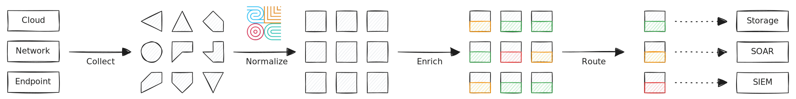
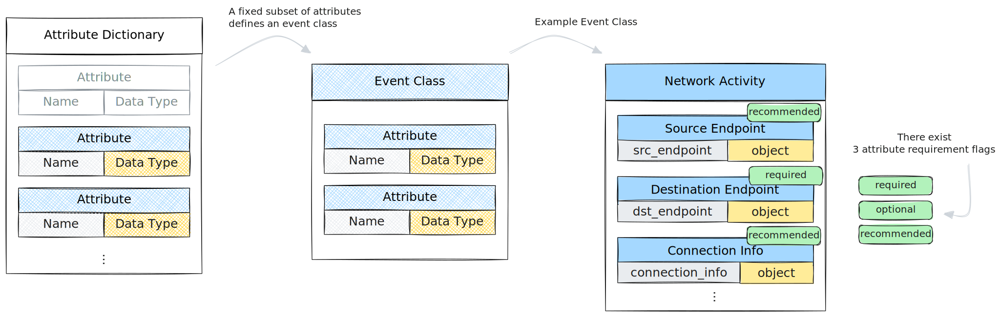
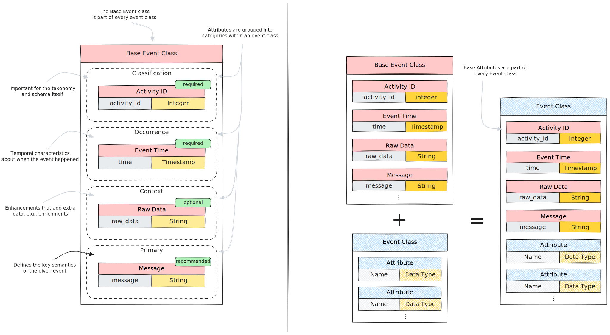
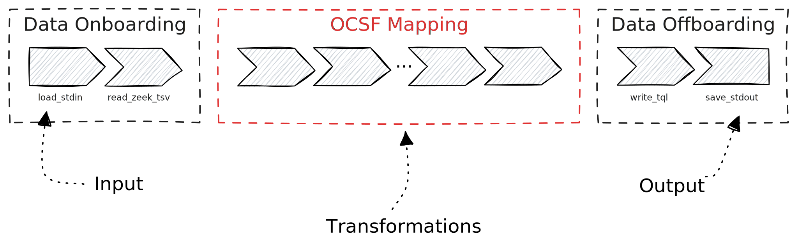

In this tutorial you'll learn how to **map events to [Open Cybersecurity Schema
Framework (OCSF)](https://schema.ocsf.io)**. We walk you through an example of
events from a network monitor and show how you can use Tenzir pipelines to
transform them into OCSF-compliant events.



The diagram above illustrates the data lifecycle and shows where the OCSF
mapping takes place: you collect data from various data sources, each of which
has a different shape, and then convert them to a standardized representation.
Normalization decouples data acquisition from downstream analytics, so you can
scale each process independently.

## OCSF Primer

OCSF is a vendor-agnostic event schema (aka. "taxonomy") that defines
structure and semantics for security events. Here are some key terms you need to
know to map events:

- **Attribute**: a unique identifier for a specific type, e.g., `parent_folder`
  of type `String` or `observables` of type `Observable Array`.
- **Event Class**: a description of an event that uses specific attributes,
  e.g., `HTTP Activity` and `Detection Finding`.
- **Category**: a group of event classes, e.g., `System Activity` or `Findings`.

The diagram below illustrates how subsets of attributes form an event class:



The **Base Event Class** is a special event class that appears in every event
class. Think of it as a mixin of attributes that OCSF automatically includes:



For this tutorial, we look at OCSF from the perspective of the _mapper_ persona,
i.e., as someone who converts existing events into the OCSF schema. OCSF also
defines three other personas, author, producer, and analyst. This tutorial
doesn't cover them. Our mission as mapper is to study the event semantics of the
data source we want to map, and translate the event to the appropriate OCSF
event class.

## Case Study: Zeek Logs

Let's map some [Zeek](https://zeek.org) logs to OCSF!

:::note[What is Zeek?]
The [Zeek](https://zeek.org) network monitor turns raw network traffic into
detailed, structured logs. The logs range across the OSI stack from link layer
activity to application-specific messages. In addition, Zeek provides a powerful
scripting language to act on network events, making it a versatile tool for
writing network-based detections to raise alerts.
:::

Zeek generates logs in tab-separated values (TSV) or JSON format. Here's an
example of a connection log in TSV format:

```text title="conn.log (TSV)"
#separator \x09
#set_separator	,
#empty_field	(empty)
#unset_field	-
#path	conn
#open	2023-03-07-10-23-46
#fields	ts	uid	id.orig_h	id.orig_p	id.resp_h	id.resp_p	id.vlan	id.vlan_inner	proto	service	duration	orig_bytes	resp_bytes	conn_state	local_orig	local_resp	missed_bytes	history	orig_pkts	orig_ip_bytes	resp_pkts	resp_ip_bytes	tunnel_parents	vlan	inner_vlan	orig_l2_addr	resp_l2_addr	geo.orig.country_code	geo.orig.region	geo.orig.city	geo.orig.latitude	geo.orig.longitude	geo.resp.country_code	geo.resp.region	geo.resp.city	geo.resp.latitude	geo.resp.longitude	community_id
#types	time	string	addr	port	addr	port	int	int	enum	string	interval	count	count	string	bool	bool	count	string	count	count	count	count	set[string]	int	int	string	string	string	string	string	double	double	string	string	string	double	double	string
1637155963.237882	CZwqhx3td8eTfCSwJb	128.14.134.170	57468	198.71.247.91	80	-	-	tcp	http	5.162805	205	278	SF	-	-	0	ShADadfF	6	525	5	546	-	-	-	64:9e:f3:be:db:66	00:16:3c:f1:fd:6d	US	CA	Los Angeles	34.0544	-118.2441	US	VA	Ashburn	39.0469	-77.4903	1:YXWfTYEyYLKVv5Ge4WqijUnKTrM=
1637157758.165570	CnrwFesjfOhI3fuu1	45.137.23.27	47958	198.71.247.91	53	-	-	udp	dns	-	-	-	S0	-	-	0	D	1	58	0	0	-	-	-	64:9e:f3:be:db:66	00:16:3c:f1:fd:6d	BD	-	-	23.7018	90.3742	US	VA	Ashburn	39.0469	-77.4903	1:0nZC/6S/pr+IceCZ04RjDZbX+KI=
1637229399.549141	CBTne9tomX1ktuCQa	10.4.21.101	53824	107.23.103.216	587	-	-	tcp	smtp	606.747526	975904	11950	SF	-	-	0	ShAdDaTtTfF	1786	1069118	1070	55168	-	-	-	00:08:02:1c:47:ae	20:e5:2a:b6:93:f1	-	-	-	-	-	US	VA	Ashburn	39.0469	-77.4903	1:I6VoTvbCqaKvPrlFnNbRRbjlMsc=
```

You can also [download this sample](/packages/zeek/tests/inputs/conn.log) to
avoid dealing with tabs and spaces in the snippet above.

### Step 1: Parse the input

We first parse the log file into a structured form so that we can work with the
individual fields. The [`read_zeek_tsv`](/reference/operators/read_zeek_tsv)
operator parses the above structure out of the box:

```sh
tenzir 'read_zeek_tsv' < conn.log
```

<details>
<summary>Output</summary>

```tql
{
  ts: 2021-11-17T13:32:43.237881856Z,
  uid: "CZwqhx3td8eTfCSwJb",
  id: {
    orig_h: 128.14.134.170,
    orig_p: 57468,
    resp_h: 198.71.247.91,
    resp_p: 80,
  },
  proto: "tcp",
  service: "http",
  duration: 5.162805s,
  orig_bytes: 205,
  resp_bytes: 278,
  conn_state: "SF",
  local_orig: null,
  local_resp: null,
  missed_bytes: 0,
  history: "ShADadfF",
  orig_pkts: 6,
  orig_ip_bytes: 525,
  resp_pkts: 5,
  resp_ip_bytes: 546,
  tunnel_parents: null,
  community_id: "1:YXWfTYEyYLKVv5Ge4WqijUnKTrM=",
  _write_ts: null,
}
{
  ts: 2021-11-17T14:02:38.165570048Z,
  uid: "CnrwFesjfOhI3fuu1",
  id: {
    orig_h: 45.137.23.27,
    orig_p: 47958,
    resp_h: 198.71.247.91,
    resp_p: 53,
  },
  proto: "udp",
  service: "dns",
  duration: null,
  orig_bytes: null,
  resp_bytes: null,
  conn_state: "S0",
  local_orig: null,
  local_resp: null,
  missed_bytes: 0,
  history: "D",
  orig_pkts: 1,
  orig_ip_bytes: 58,
  resp_pkts: 0,
  resp_ip_bytes: 0,
  tunnel_parents: null,
  community_id: "1:0nZC/6S/pr+IceCZ04RjDZbX+KI=",
  _write_ts: null,
}
{
  ts: 2021-11-18T09:56:39.549140992Z,
  uid: "CBTne9tomX1ktuCQa",
  id: {
    orig_h: 10.4.21.101,
    orig_p: 53824,
    resp_h: 107.23.103.216,
    resp_p: 587,
  },
  proto: "tcp",
  service: "smtp",
  duration: 10.112458766666666min,
  orig_bytes: 975904,
  resp_bytes: 11950,
  conn_state: "SF",
  local_orig: null,
  local_resp: null,
  missed_bytes: 0,
  history: "ShAdDaTtTfF",
  orig_pkts: 1786,
  orig_ip_bytes: 1069118,
  resp_pkts: 1070,
  resp_ip_bytes: 55168,
  tunnel_parents: null,
  community_id: "1:I6VoTvbCqaKvPrlFnNbRRbjlMsc=",
  _write_ts: null,
}
```

</details>

Now that we have decomposed the data into its atomic values, we can map them to
the corresponding OCSF fields.

### Step 2: Map to OCSF

To map fields, you must first identify the appropriate OCSF event class. In our
example, the corresponding event class in OCSF is [Network
Activity](https://schema.ocsf.io/1.6.0/classes/network_activity). We use OCSF
v1.6.0 throughout this tutorial.

To make the mapping process more organized, we map per _attribute group_. The
schema has four groups:

1. **Classification**: Important for the taxonomy and schema itself
2. **Occurrence**: Temporal characteristics about when the event happened
3. **Context**: Auxiliary information about the event
4. **Primary**: Defines the key semantics of the given event

Here's a template for the mapping pipeline:

```tql
// --- Preamble ---------------------------------

// Move the original event into a dedicated field that we pull our values from.
// We recommend naming the field so that it represents the respective data
// source.
this = { zeek: this }

// (2) Populate the OCSF event. Style-wise, we recommend using one coherent
// block of TQL per OCSF attribute group to provide a bit of structure for the
// reader.

// --- OCSF: classification attributes ----------

ocsf.activity_id = 6
ocsf.class_uid = 4001
// ...fill out remaining classification attributes.

// --- OCSF: occurence attributes ---------------

ocsf.time = move zeek.ts // 👈 remove source field while mapping
ocsf.duration = move zeek.duration
ocsf.end_time = ocsf.time + ocsf.duration
ocsf.start_time = ocsf.time
// ...fill out remaining occurence attributes.

// --- OCSF: context attributes -----------------

ocsf.metadata = {
  product: {
    name: "Zeek",
  },
  uid: move zeek.uid,
  version: "1.6.0",
}
// ...fill out remaining context attributes.

// --- OCSF: primary attributes -----------------

ocsf.src_endpoint = {
  ip: zeek.id.orig_h,
  port: zeek.id.orig_p,
}
// ...fill out remaining primary attributes.
drop zeek.id // 👈 remove source field after mapping

// --- Finalize ---------------------------------

// (3) Hoist all `ocsf` attributes into the root and declare the remaining fields in
// `zeek` as `unmapped`.
this = {...ocsf, unmapped: zeek}

// (4) Assign metadata, such as a name for easier filtering downstream.
@name = "ocsf.network_activity"
```

import { Steps } from "@astrojs/starlight/components";

Let's unpack this:

<Steps>

1. With `this = { zeek: this }` we move the original event into the field
   `zeek`. This approach also avoids name clashes when we create new fields in
   the next steps. Because we are mapping Zeek logs, we chose `zeek` as a name
   to make the subsequent mappings almost self-explanatory.
2. The main work takes place here. Our approach is structured: for every field
   in the source event, (1) map it, and (2) remove it. Ideally, use the `move`
   keyword to perform (1) and (2) together, e.g., `ocsf.x = move source.y`. If
   a field needs to be used multiple times in the same expression, use the
   [`drop`](/reference/operators/drop) afterwards.
3. The assignment `this = {...ocsf, unmapped: zeek}` means that we move all
   fields from the `ocsf` record into the top-level record (`this`), and at the
   same time add a new field `unmapped` that contains everything that we didn't
   map. This is why it's important to remove the fields from the source as we
   perform the mapping. If you forget to map a field, it simply lands in the
   `unmapped` catch-all record and you can tweak your mapping later.
4. We give the event a new schema name so that we can easily filter by its shape
   in further pipelines.

</Steps>

Now that we have a template, let's get our hands dirty and go deep into the
actual mapping.

#### Classification Attributes

The classification attributes are important for the schema. Mapping them is
mechanical and mostly involves reviewing the schema docs.

```tql
ocsf.activity_id = 6
ocsf.activity_name = "Traffic"
ocsf.category_uid = 4
ocsf.category_name = "Network Activity"
ocsf.class_uid = 4001
ocsf.class_name = "Network Activity"
ocsf.severity_id = 1
ocsf.severity = "Informational"
ocsf.type_uid = ocsf.class_uid * 100 + ocsf.activity_id
```

Note that computing the field `type_uid` requires simple arithmetic. You can
also rely on [`ocsf::derive`](/reference/operators/ocsf/derive) to populate
sibling fields—an optimization to write more concise mappings.

#### Occurrence Attributes

Let's tackle the occurrence group. These attributes are all about time.

```tql
ocsf.time = move zeek.ts
ocsf.duration = move zeek.duration
ocsf.end_time = ocsf.time + ocsf.duration
ocsf.start_time = ocsf.time
```

Using `+` with a value of type `time` and `duration` yields a new `time` value,
just as you'd expect.

#### Context Attributes

The context attributes provide auxiliary information. Most notably, the
`metadata` attribute holds data-source specific information. Even though
`unmapped` belongs to this group, we deal with it at the very end.

```tql
ocsf.metadata = {
  log_name: "conn.log",
  logged_time: move zeek._write_ts?,
  product: {
    name: "Zeek",
    vendor_name: "Zeek",
    cpe_name: "cpe:2.3:a:zeek:zeek",
  },
  uid: move zeek.uid,
  version: "1.6.0",
}
drop zeek._path? // implied in metadata.log_name
ocsf.app_name = move zeek.service
```

We use `?` when accessing fields that are not always present, e.g.,
`zeek._write_ts?`. If you omit the `?`, the pipeline emits a warning when
`_write_ts` is missing.

#### Primary Attributes

The primary attributes define the semantics of the event class itself. This is
where the core value of the data is, as we are mapping the most event-specific
information.

```tql
ocsf.src_endpoint = {
  ip: zeek.id.orig_h,
  port: zeek.id.orig_p,
}
ocsf.dst_endpoint = {
  ip: zeek.id.resp_h,
  port: zeek.id.resp_p,
}
// Here, we use `drop` because we simply want to get rid of the intermediate
// `id` record that we already mapped above.
drop zeek.id
// Locality of reference: we define the protocol numbers close where they are
// used for easier readability.
let $proto_nums = {
  tcp: 6,
  udp: 17,
  icmp: 1,
  icmpv6: 58,
  ipv6: 41,
}
ocsf.connection_info = {
  community_uid: move zeek.community_id?,
  protocol_name: move zeek.proto,
  protocol_num: $proto_nums[zeek.proto]? else -1
}
// If we cannot use static records, branch with if/else statements.
if ocsf.src_endpoint.ip.is_v6() or ocsf.dst_endpoint.ip.is_v6() {
  ocsf.connection_info.protocol_ver_id = 6
} else {
  ocsf.connection_info.protocol_ver_id = 4
}
if zeek.local_orig and zeek.local_resp {
  ocsf.connection_info.direction = "Lateral"
  ocsf.connection_info.direction_id = 3
} else if zeek.local_orig {
  ocsf.connection_info.direction = "Outbound"
  ocsf.connection_info.direction_id = 2
} else if zeek.local_resp {
  ocsf.connection_info.direction = "Inbound"
  ocsf.connection_info.direction_id = 1
} else {
  ocsf.connection_info.direction = "Unknown"
  ocsf.connection_info.direction_id = 0
}
drop zeek.local_orig, zeek.local_resp
// The `status` attribute in OCSF is a success indicator. While we could use
// `zeek.conn_state` to extract success/failure, this would go beyond the
// tutorial.
ocsf.status_id = 99
ocsf.status = "Other"
ocsf.status_code = move zeek.conn_state
ocsf.traffic = {
  bytes_in: zeek.resp_bytes,
  bytes_out: zeek.orig_bytes,
  packets_in: zeek.resp_pkts,
  packets_out: zeek.orig_pkts,
  total_bytes: zeek.orig_bytes + zeek.resp_bytes,
  total_packets: zeek.orig_pkts + zeek.resp_pkts,
}
drop zeek.resp_bytes, zeek.orig_bytes, zeek.resp_pkts, zeek.orig_pkts
```

Here's what happens here:

- The expression `$proto_nums[zeek.proto]` takes the value of Zeek's
  `proto` field (e.g., `tcp`) and uses it as an index into a static record
  `$proto_nums`. Add a `?` at the end to avoid warnings when the lookup returns
  `null`, and use the inline `else` expression for the fallback value.
- To check whether we have an IPv4 or an IPv6 connection, we call
  [`is_v6()`](/reference/functions/is_v6) on the IPs of the connection record.
  TQL comes with numerous other domain-specific
  [functions](/reference/functions) that make mapping security data a breeze.

#### Putting it together

When we combine all TQL snippets from above, we get the following output:

import { Code } from "@astrojs/starlight/components";

import mapOneTxt from '/public/packages/zeek/tests/map_one.txt?raw';

<Code code={mapOneTxt} lang="tql" />

There are still several fields that we can map to the schema, but we'll leave
this as an exercise for the reader.

#### Recap: Understand the OCSF pipeline architecture

Most pipelines (1) onboard data from a source, (2) transform it, and (3) send it
somewhere. This tutorial focuses on the middle piece, with transformation being
the mapping to OCSF.



We've addressed data _onboarding_ by reading a log file and decomposing the
unstructured Zeek TSV contents into a structured record. The built-in
[`read_zeek_tsv`](/reference/operators/read_zeek_tsv) operator made this
trivial. But it often requires a lot more elbow grease to get there. Check out
our extensive [guide on extracting structured data from
text](/guides/data-shaping/extract-structured-data-from-text/) for more details.
We haven't yet addressed the other end of the pipeline: data _offboarding_. Our
examples run `tenzir` on the command line, relying on an implicit output
operator that writes the result of the last transformation to the terminal.

In other words, we have a sandwich structure in our pipeline. To make it
explicit:

```tql
// (1) Onboard data (explicit)
load_stdin
read_zeek_tsv

// (2) Map to OCSF
// ...
// Lots of TQL here!
// ...

// (3) Offboard data (implicit)
write_tql
save_stdout
```

Such a pipeline is impractical because data may arrive via multiple channels:
log files, Kafka messages, or via Syslog over the wire. Even the encoding may
vary. Zeek TSV is one way you can configure Zeek, but JSON output is another
format. Similarly, users may want to consume the data in various ways.

In theory, we're done now. We have a working mapping. It's just not yet very
(re)usable. For maximum flexibility, we want to split the pipeline into
independently usable snippets. The next section describes how to achieve this.

### Step 3: Package the mapping

To make our OCSF mapping more reusable, we extract it as **user-defined
operator** and put it into a [package](/explanations/packages). There is an
entire [tutorial on writing packages](/tutorials/write-a-package), but all you
need to know right now that packages are one-click installable bundles that you
can flexibly deploy. After installation, you can call the newly introduced
mapping operators from any pipeline.

#### Break down complexity with user-defined operators

Let's work towards a package that comes with a user-defined operator called
`zeek::ocsf::map` that maps Zeek connection logs to OCSF:

```tql
load_stdin
read_zeek_tsv
zeek::ocsf::map // 👈 Maps Zeek logs to OCSF with a user-defined operator.
write_tql
save_stdout
```

All you have to do to get there is create a package with following directory
structure:

import { FileTree } from '@astrojs/starlight/components';

<FileTree>

- zeek/
  - examples/
  - operators/ 👈 user-defined operators go here
  - pipelines/
  - tests/
  - package.yaml

</FileTree>

Notice how `zeek::ocsf::map` has two modules that are colon-separated: `zeek`
and `ocsf`. The directory structure in the package determines the module
hierarchy:

<FileTree>

- zeek/
  - operators/
    - ocsf/
      - map.tql 👈 Exposes `zeek::ocsf::map` as operator

</FileTree>

Since operators fully compose, you can implement `zeek::ocsf::map` as a
combination of other operators, e.g., one operator per log type:

import mapTql from '/public/packages/zeek/operators/ocsf/map.tql?raw';

<Code code={mapTql} lang="tql" title="zeek/operators/ocsf/map.tql" />

In this layout, you'd put the mapping operators in the following directories:

<FileTree>

- zeek/
  - operators/
    - ocsf/
      - logs/ 👈 Exposes `zeek::ocsf::log::*` operators
        - conn.tql
        - dns.tql
        - ...
      - map.tql

</FileTree>

#### Write tests for prod-grade reliability

To achieve production-grade quality of your mappings, you must ensure that they
do what they promise. In practice, this means shipping tests along the mappings:
given a mapping, test whether a provided input produces a valid output.

:::tip[Package writing tutorial]
We have an [in-depth tutorial on how to write
packages](/tutorials/write-a-package). This is just a small excerpt to showcase
you you can test your OCSF mappings.
:::

This is where our [test framework](/reference/test-framework) comes into play.
Put your test scenarios in `tests/` and sample data into `tests/inputs`:

<FileTree>

- zeek/
  - tests/
    - inputs/ 👈 raw log samples
      - conn.log
      - ...
    - map_one.tql 👈 test scenario go anywhere else
    - map_one.txt 👈 expected output for test scneario
    - ...

</FileTree>

Here's an example of the test:

import mapOneTql from '/public/packages/zeek/tests/map_one.tql?raw';

<Code code={mapOneTql} lang="tql" title="zeek/tests/map_one.tql" />

Now run the test framework in the package directory:

```sh
uvx tenzir-test
```

```txt
i executing project: zeek (.)
i running 1 tests (44 jobs) in project .
i   1× tenzir (v5.16.0+gc0a0c3ba49)
✘ tests/map_one.tql
└─▶ Failed to find ref file: "../docs/public/packages/zeek/tests/map_one.txt"
i ran 1 test: 0 passed (0%) / 1 failed (100%)
 passed (100%) / 0 failed (0%)
```

There is no baseline for the test yet, let's generate it via `--update`

```sh
uvx tenzir-test --update
```

Now there's a \*.txt file next to the test scenario. Verify it that it has the
expected output. Alternatively, use `uvx tenzir-test --passthrough` to print the
output to the terminal for inline inspection.

<details>
<summary>Generated *.txt test scenario baseline</summary>

<Code code={mapOneTxt} lang="tql" title="zeek/tests/map_one.txt" />

</details>

After running `uvx tenzir-test` again without any flags, you get the following output:

```txt
i executing project: zeek (.)
i running 1 tests (44 jobs) in project .; update
i   1× tenzir (v5.16.0+gc0a0c3ba49)
✔ tests/map_one.tql
i ran 1 test: 1 passed (100%) / 0 failed (0%)
```

Perfect. Now proceed with all log types and you have production-grade package.

### Step 4: Install and use the package

After you have fleshed out the complete package, [install
it](/guides/basic-usage/install-a-package), either interactively via
[`package::add`](/reference/operators/package/add), or IaC-style by putting it
into a git repo and pointing the config option `tenzir.package-dirs` to it.

:::tip[Tenzir Community Library]
Wrote a package that anyone could benefit from? Contribute it to the [Tenzir
Community Library](https://github.com/tenzir/library)! This GitHub repository
hosts a collection of packages with pre-packaged OCSF mappings and other use
cases.
:::

## Summary

This tutorial showed you how to map security data to OCSF using TQL
pipelines. You learned:

- How OCSF events look like in high-level terms
- How to structure your mapping pipeline using OCSF attribute groups
  (classification, occurrence, context, and primary)
- How to use TQL operators and expressions to transform raw events into
  OCSF-compliant records
- How to package your mappings as reusable operators in a Tenzir package

The key to successful OCSF mapping is systematic organization: move your source
event into a dedicated field, map attributes group by group while removing
source fields as you go, and collect any unmapped fields in a catch-all record.
This approach ensures you don't miss any fields and makes your mappings easy to
maintain and extend.

For more examples and ready-to-use OCSF mappings, check out the [Tenzir
Community Library](https://github.com/tenzir/library).
